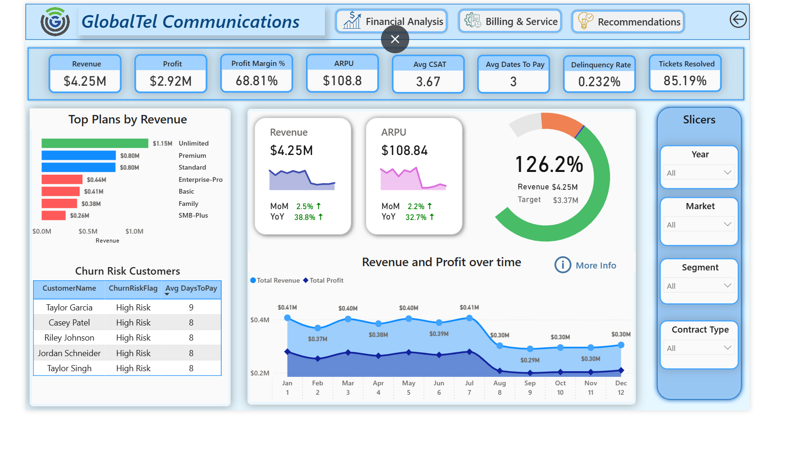
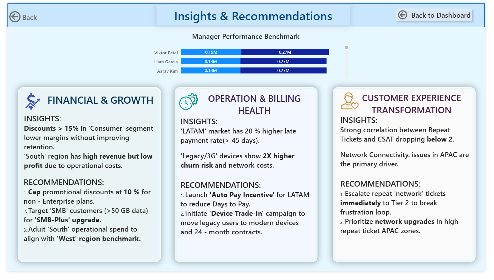

# GlobalTel Communications Dashboard

### Project Overview
This project transforms raw telecommunications data into a high-performance visual narrative. Moving from my background in texturing to data, I focused on creating a dashboard that doesn't just show numbers but tells the story of customer behavior and operational efficiency.

### Tech Stack
* **Tool:** Power BI Desktop
* **Key Skills:** DAX (Data Analysis Expressions), Data Modeling, Advanced Drill-through.

---

### Project Screenshots
| Main Executive Summary | Insights & Recommendations |
| :---: | :---: |
|  |  |

---

### Key Technical Features

#### 1. Strategic KPI Tracking
I implemented a high-level executive header tracking core business metrics to provide instant health checks:
* **Financials:** Total Revenue ($4.25M), Total Profit ($2.92M), and a healthy 68.81% Profit Margin.
* **Customer Health:** Average CSAT (3.67), Delinquency Rate (0.232%), and an 85.19% Ticket Resolution rate.
* **Efficiency:** Average ARPU of $108.8 and an Average of 3 days to pay.

#### 2. Advanced Drill-through Functionality
To enable deep-dive analysis, I configured a **Drill-through** action on the **Churn Risk Customers** table. 
* **Action:** Users can right-click a high-risk customer (like *Taylor Garcia*) to navigate to a personalized detail page.
* **Result:** This reveals specific customer data including their Region, Device Category (e.g., Smartphone-Mid), and specific revenue vs. profit contribution to help retention teams take targeted action.

#### 3. Dedicated Insights & Recommendations Page
Unlike standard dashboards, this project includes a specific "Management View" for strategic planning:
* **Financial & Growth:** Recommendations to cap promotional discounts and target high-data users for upgrades.
* **Operations:** Identifying LATAM market payment trends and "Legacy/3G" device churn risks.
* **Customer Experience:** Correlating repeat tickets with CSAT drops to recommend Tier 2 escalation paths.

---

### How to View
1. Download the `.pbix` file.
2. Open with Power BI Desktop to interact with the filters, slicers, and drill-through features.

---
*A restless mind is better than a stagnant one—constantly iterating on data clarity.*
